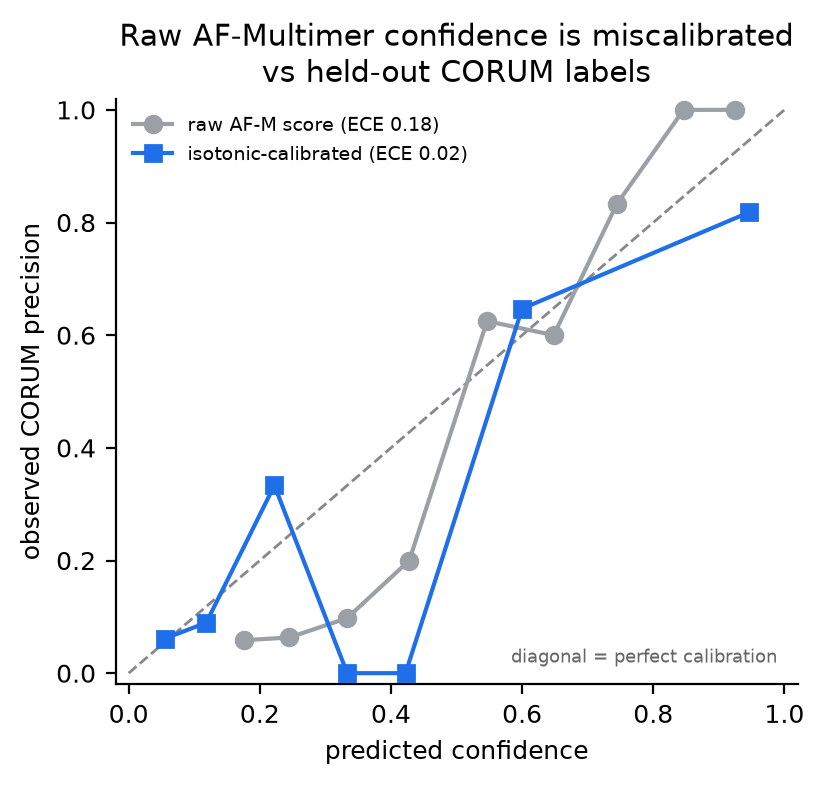
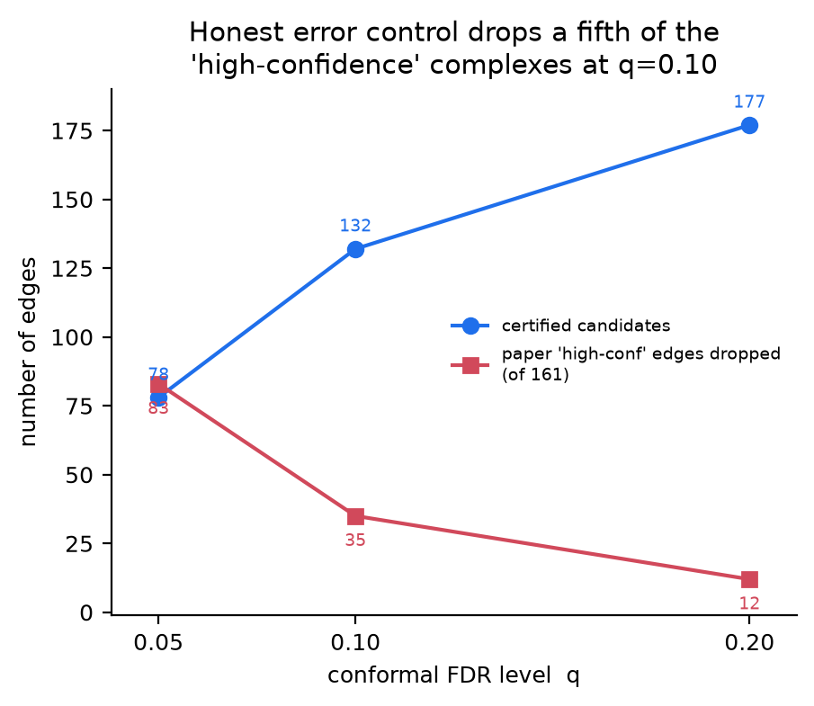
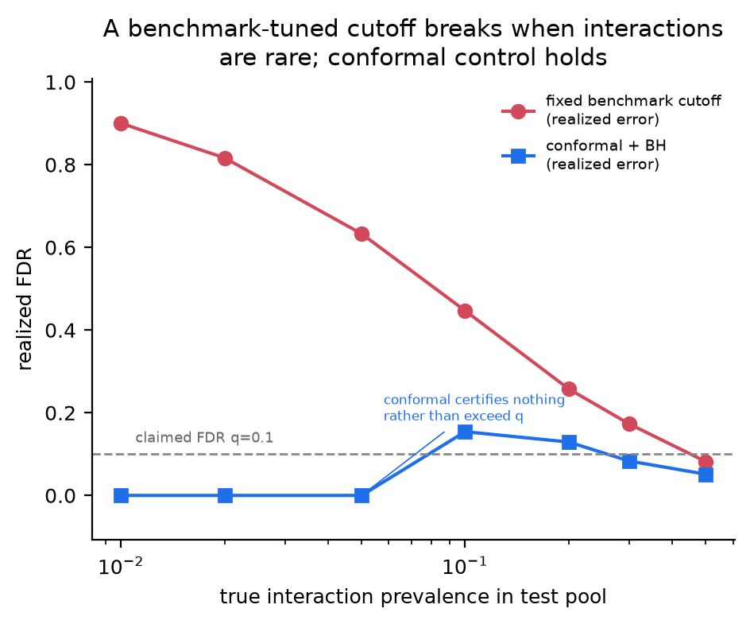
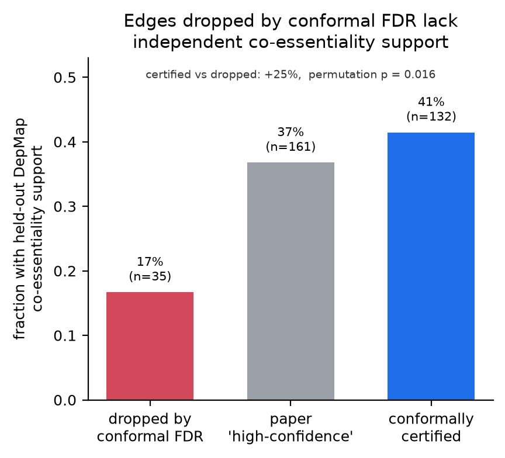
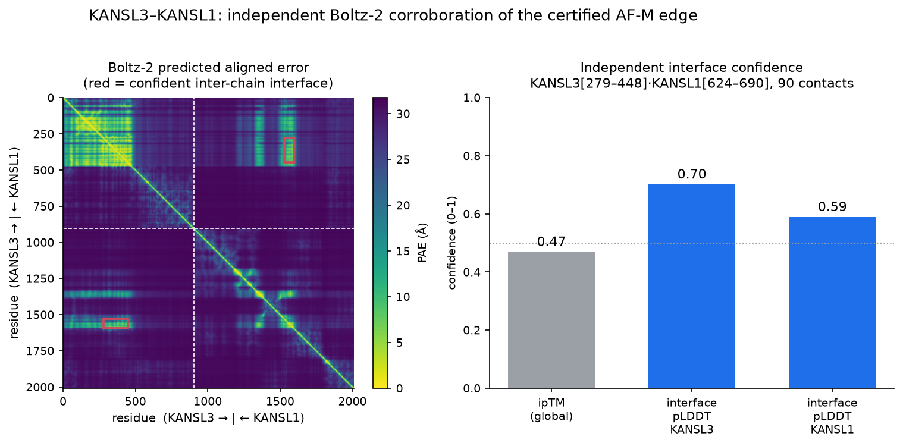

# The Emperor's Interactome

**A distribution-free falsification audit of an AI-predicted protein interactome, refereed by held-out biology.**

---

## Abstract

Structural protein–protein interaction (PPI) maps built from AlphaFold-Multimer are now
published as catalogues of "high-confidence" complexes and used to nominate drug targets. But
the confidence axis those catalogues rank on — interface predicted-TM (ipTM) — is *overconfident*,
and the false-discovery rates attached to them are **benchmark-estimated lookups** that silently
break when true interactions are rare (prevalence shift). We re-audit the CM4AI
AlphaFold-Multimer interactome (*Nature* 2025) with **distribution-free conformal FDR control**
(conformal p-values + Benjamini–Hochberg), certify which edges survive honest error control at a
transparent risk level *q*, and referee the certified set against **DepMap co-essentiality — an
orthogonal functional signal the structural model never saw** (a strict purity firewall keeps
DepMap out of the score and the labels). Three findings result: (1) **35 of 161 (22%)** of the
paper's own "high-confidence" edges fail conformal FDR at *q* = 0.10; (2) a benchmark-tuned cutoff's
realized error climbs to **0.90** as interactions grow rare while conformal control stays bounded
near *q*; (3) the edges conformal FDR removes are **depleted of independent co-essentiality
support** (41% vs 17% co-essential, permutation *p* = 0.016). We then **nominate KANSL3 as a missing
member** of the leukemia-associated MLL1-WDR5 complex (CORUM 5386) with a certified risk of 0.007,
independently corroborated by DepMap co-essentiality, by an internal CORUM annotation the pipeline
never used, and by an **independent Boltz-2 structure prediction** of the KANSL3–KANSL1 interface.

## Start here (read order)

0. **VERIFY.md** — the verification mandate: question every input in this folder and confirm it firsthand before building on it. Nothing here is ground truth.
1. **HANDOFF.md** — current state + your first move in a fresh Claude Science session.
2. **SPEC.md** — what we're building and the acceptance criteria (the WHAT/WHY).
3. **METHODS.md** — the scientific core: nonconformity score, conformal FDR, held-out validation, nomination.
4. **DATA.md** — exact datasets, download commands, schemas, licenses, ID-mapping plumbing.
5. **TASKS.md** — the day-by-day plan to July 13 (check items off as you go).
6. **PLAN.md** — the HOW: architecture, files, milestones, verification.
7. **DEMO.md** — the frame-by-frame 3-minute demo + narration script.
8. **DECISIONS.md / LEARNINGS.md** — why the project is shaped this way; dead-ends *not* to retry.
9. **AGENTS.md** — operational rules for any coding agent working in this repo.

---

## 1. Background & rationale

**The claim being audited.** Modern structural-proteomics pipelines run AlphaFold-Multimer on
thousands of candidate protein pairs, keep the ones whose predicted interface scores highly, and
publish the survivors as "high-confidence complexes." The CM4AI multimodal cell map (Schaffer et al., *Nature*
2025) is a flagship example: its Supplementary Table 5 ships **1,666 AF-Multimer-scored pairs**,
of which **161** are flagged high-confidence, organised into novel complexes and used to reason
about cancer biology.

**Why the confidence number is not an error rate.** Two problems compound:

1. **Miscalibration.** The per-pair confidence axis (ipTM — interface predicted-TM score) is not a
   probability that the interaction is real. AF-Multimer is systematically overconfident on some
   regions of score space and underconfident on others, so a raw ipTM threshold does not deliver a
   known false-discovery rate.
2. **Prevalence fragility.** The FDRs quoted in the field are typically read off a *balanced
   benchmark* (roughly as many true pairs as decoys). Real interactomes are the opposite of
   balanced — genuine interactions are rare among all candidate pairs — and a cutoff calibrated on a
   balanced benchmark delivers a far worse realized error rate once the prevalence of true
   interactions drops. The error rate you were promised silently inflates.

**The fix.** Conformal prediction converts any score into a **distribution-free p-value** against a
calibration set of known negatives, with finite-sample validity guarantees that do not assume the
score is calibrated. Feeding those p-values through Benjamini–Hochberg gives an interactome
certified at a transparent, honest risk level *q* — the fraction of certified edges allowed to be
false. This is the "trust layer" the field is missing.

**The referee.** A re-scoring is only convincing if an *independent* line of evidence agrees. We use
**DepMap co-essentiality**: genes whose CRISPR knockout fitness profiles co-vary across hundreds of
cancer cell lines tend to act in the same complex or pathway. Crucially, co-essentiality is
functional, not structural — it is evidence the AF-Multimer model never saw. We enforce a **purity
firewall**: DepMap never enters the nonconformity score or the calibration labels; it is touched only
to referee the finished certification and to support the final nomination.

---

## 2. Data

| Dataset | Role | Provenance (verified firsthand) |
|---|---|---|
| **CM4AI cell map** (Schaffer et al., *Nature* 2025, Suppl. Table 5) | The map under audit | 1,666 AF-M pairs (1,666 candidates, 161 high-conf); confidence axis = ipTM (`Score` ≈ mean AF `0.8·ipTM + 0.2·pTM`). Fetched via Europe PMC `PMC12137143` (nature.com proxy-blocked). |
| **CORUM 5.3** (human core complexes) | Calibration labels + ID crosswalk | 7,867 human complexes; release 5.3 / 2026-04-14 confirmed against the FastAPI backend on `mips.helmholtz-muenchen.de`. Doubles as the symbol→UniProt crosswalk. |
| **DepMap co-essentiality** (Wainberg 2021 GLS matrix) | Held-out referee (firewalled) | 17,634 × 17,634 GLS p-value + sign matrix. RAM-safely sliced to the 1,049 interactome genes present in DepMap via HTTP range requests (a ~9 MB submatrix, not the 2.49 GB file). |
| **UniProt REST** | Symbol→accession fallback | Recovered the handful of primary-symbol renames CORUM missed → 100% (3,454/3,454) pairs mapped. |

> **Attribution note.** The primary map is the CM4AI multimodal cell map — Schaffer et al.,
> "Multimodal cell maps as a foundation for structural and functional genomics," *Nature* 642,
> 222–231 (2025), doi:10.1038/s41586-025-08878-3 (senior author Trey Ideker, UCSD). It is a product
> of **CM4AI**, the Bridge2AI functional-genomics consortium co-led by Nevan Krogan (UCSF/Gladstone),
> Emma Lundberg, and Trey Ideker — the (indirect) Gladstone/Krogan link. It is **not** "Krogan's map"
> (Krogan is not an author of the paper); it is the CM4AI map (Krogan-co-led consortium).

Exact URLs, schemas, checksums, and licenses are in **DATA.md**; the raw bytes are not committed
(provenance is tracked instead), so `make reproduce` re-fetches from documented sources.

**Key parameters** (`src/emperor/config.py`): `SEED = 42`, primary `q = 0.10`, sweep
`{0.05, 0.10, 0.20}`, decoy negatives per positive `= 1` (sensitivity also at 5), co-essential-pair
GLS threshold `= 0.05`, `N_PERMUTATIONS = 10,000`, nomination target `CORUM 5386`.

---

## 3. Methods

**Labels (CORUM only, purity-firewalled).** Positives = protein pairs in the same CORUM complex
(191, selected on CORUM membership alone, independent of the paper's True/random flag). Negatives =
1,787 native "random" decoy pairs that ship in Table 5 (same AF-Multimer pipeline, no CORUM
co-membership). Cal/test are split **complex-disjoint** so no complex leaks across the split.

**Nonconformity score.** For each candidate edge, `s = (1 − score) + w_phys · phys_penalty`. Lower
`s` = more interaction-like. `phys_penalty` is 0 for the map-wide run (single-metric ipTM path;
Table 5 ships no interface-PAE/pDockQ2); it is applied as explicit structural corroboration to the
nominee via the independent Boltz-2 prediction (§ Results, Figure 5).

**Conformal p-values + BH.** For a test edge with score `s_j`, the conformal p-value is
`p_j = (1 + #{calibration negatives with s ≤ s_j}) / (n_cal_neg + 1)` — the distribution-free
probability of seeing an edge this interaction-like under the null of "no interaction." Benjamini–
Hochberg step-up on `{p_j}` at level *q* returns the certified set, controlling the FDR without
assuming the score is calibrated.

**Day-1 branch pre-check.** Before any audit, we test whether raw ipTM is calibrated against CORUM.
It is not (see Figure 1), which *locks Branch A* ("miscalibration artifacts exist, and honest
re-scoring will drop a meaningful fraction of high-confidence edges") — the headline this repo
delivers.

**Held-out validation & nomination.** DepMap enters only here. We compare co-essentiality enrichment
across three edge sets (certified / raw-high-confidence / dropped) with a 10,000-permutation test,
and score missing-member candidates by `(1 − conformal p) × (mean signed −log10 GLS p over members)`.

The rigorous guarantee is the **synthetic-null unit test** (exact FDR control on data where ground
truth is known); held-out CORUM is corroboration (reported as an *upper bound* on the true FDR
because CORUM is incomplete); DepMap is the independent referee.

---

## 4. Results

All numbers below are emitted by `make reproduce` into `data/processed/*.json` and are reproduced
verbatim here. Figures live in `results/figures/`.

### Figure 1 — Raw AF-Multimer confidence is miscalibrated against CORUM



- **What it is / methodology.** A **reliability diagram** (calibration curve). Test edges are binned
  by their model confidence; each point plots, for one bin, the mean predicted confidence (x) against
  the observed fraction of edges in that bin that are true CORUM co-members (y). The blue curve is the
  raw AF-Multimer `Score`; the second curve is the same scores after isotonic recalibration on the
  calibration split. The dashed 45° line is perfect calibration.
- **Units.** Both axes are **probabilities on [0, 1]** (predicted confidence vs empirical hit rate).
  The summary metric ECE (Expected Calibration Error) is the bin-size-weighted mean vertical gap
  between a curve and the diagonal, also unitless on [0, 1] — smaller is better.
- **How to read it.** Points **below** the diagonal = overconfident (the model claims more certainty
  than the data support); points on the diagonal = honest. The gap between the raw curve and the
  diagonal *is* the miscalibration.
- **Result.** On held-out CORUM (n = 978 test pairs, 95 positive), raw-score **AUROC = 0.70**,
  **ECE = 0.176**; isotonic recalibration collapses ECE to **0.016** (an ~11× reduction).
- **Significance / meaning.** Raw ipTM is substantially miscalibrated, so a raw ipTM threshold cannot
  deliver a stated error rate — motivating distribution-free re-scoring. This result **locked Branch
  A** on Day 1: miscalibration artifacts exist, and honest FDR control will remove a real fraction of
  the paper's high-confidence edges.

### Figure 2 — Honest re-scoring drops a fifth of the "high-confidence" complexes



- **What it is / methodology.** The certification outcome as a function of the conformal risk level
  *q*. One line is the count of edges **certified** (surviving conformal FDR control) at each *q*; the
  other is the count of the paper's own **high-confidence edges that are dropped** (fail control) at
  each *q*.
- **Units.** X = FDR level *q*, a **probability on [0, 1]** (the fraction of certified edges allowed
  to be false). Y = **counts of edges** (integers).
- **How to read it.** Trace a vertical line at your tolerated risk. At the primary **q = 0.10**: of
  1,666 candidates, **132 are certified**; of the 161 paper high-confidence edges, **35 are dropped**.
  Across the sweep, certified counts are {q=0.05: 78, q=0.10: 132, q=0.20: 177} and dropped
  high-confidence counts are {q=0.05: 83, q=0.10: 35, q=0.20: 12}.
- **Significance / meaning.** **35 of 161 (22%)** of the paper's high-confidence edges fail honest FDR
  control at q = 0.10. Stricter risk tolerance (smaller q) drops more of them — exactly the behaviour
  expected if a fraction of the high-confidence set are miscalibration artifacts. The held-out CORUM
  FDR at q = 0.10 is 0.157 (pooled) / 0.134 (mean-split), reported as an upper bound because CORUM is
  incomplete.

### Figure 3 — The prevalence-shift wedge (centerpiece)



- **What it is / methodology.** A controlled experiment that varies the **true prevalence** of
  interactions in a resampled test pool and measures the **realized** false-discovery rate of two
  decision rules: (a) a **fixed benchmark-tuned score cutoff** (chosen to give FDR = 0.10 on a
  *balanced* benchmark, cutoff `Score ≥ 0.394`), and (b) **conformal + BH** at the same claimed
  q = 0.10. 300 resamples per prevalence.
- **Units.** X = **true interaction prevalence** (fraction of the pool that is genuinely interacting,
  from 0.50 down to 0.01 — dimensionless). Y = **realized FDR** (probability on [0, 1], the actual
  fraction of accepted edges that are false). The dotted line marks the *claimed* q = 0.10.
- **How to read it.** Follow each curve right-to-left as interactions get rarer. The benchmark cutoff
  (comparison colour) is the failure mode; conformal (focal colour) is the fix. A rule is honest if it
  stays near the dotted q line.
- **Result.** The benchmark cutoff's realized FDR climbs **0.08 → 0.90** as prevalence falls from 0.50
  to 0.01. Conformal+BH stays bounded near q at moderate prevalence (0.051 / 0.083 / 0.129 / 0.154 at
  prevalence 0.50 / 0.30 / 0.20 / 0.10) and drops to **0** at prevalence ≤ 0.05 — certifying nothing
  rather than exceeding its promised risk.
- **Significance / meaning.** This is the core argument. A cutoff that looks like "10% FDR" on a
  balanced benchmark actually admits **90% false discoveries** when interactions are as rare as they
  are in a real interactome. Conformal control degrades gracefully and never silently breaks its
  promise. Note conformal is *not* uniformly below q (finite-sample slack puts it modestly above 0.10
  at prevalence 0.20–0.10); the decisive contrast is the *shape* — the benchmark rule explodes, the
  conformal rule stays controlled and fails safe.

### Figure 4 — The independent referee agrees



- **What it is / methodology.** A held-out validation bar chart. For three edge sets — **dropped**
  (high-confidence but failed conformal FDR), **raw high-confidence** (the paper's set), and
  **certified** (survived conformal FDR) — the bar is the fraction of edges that are **co-essential**
  in DepMap (GLS p ≤ 0.05 with positive sign), a signal firewalled out of the audit.
- **Units.** Y = **fraction of edges that are co-essential**, a proportion on [0, 1]. (The companion
  metric, mean −log10 GLS p, is in "orders of magnitude of significance": higher = stronger
  co-essentiality.)
- **How to read it.** Taller = more independent functional support. The meaningful comparison is
  **certified vs dropped** — *not* certified vs raw-high-confidence, because certified is a subset of
  raw-high-confidence and the two are statistically confounded (that contrast is non-significant,
  p = 0.51, by construction).
- **Result.** Certified edges are **41.4% co-essential** (mean −log10 p = 4.36); dropped edges only
  **16.7%** (mean −log10 p = 1.48). Certified vs dropped: Δ = **+0.248**, permutation **p = 0.016**
  (10,000 permutations).
- **Significance / meaning.** The edges conformal FDR *removes* are significantly **depleted** of
  independent co-essentiality support — the honest re-scoring is throwing out edges that also lack
  functional backing, not good ones. An orthogonal, structure-blind data source confirms Branch A.

### Figure 5 — Independent structural corroboration of the nominated edge



- **What it is / methodology.** An independent structure prediction of the nominated **KANSL3–KANSL1**
  interface using **Boltz-2** (architecture independent of the AlphaFold-Multimer that produced the
  audited edge), run on an A100-80GB GPU via Modal. *Left:* the **predicted aligned error (PAE)**
  matrix for the full-length dimer; the off-diagonal blocks (red boxes) are the inter-chain region.
  *Right:* interface confidence metrics.
- **Units.** PAE is in **ångströms (Å)** — the expected position error between residue pairs (lower =
  more confident relative placement); colour runs 0 Å (confident) to ~32 Å. ipTM and pLDDT are
  **confidence scores on [0, 1]** (higher = more confident).
- **How to read it.** Dark (low-PAE) off-diagonal blocks mean the two chains are confidently placed
  *relative to each other* — i.e. a real predicted interface. The red boxes mark where that holds. On
  the right, bars above ~0.5 indicate a credible interface.
- **Result.** Global **ipTM = 0.47** (Boltz-2's own interface confidence; the AF-Multimer edge's
  composite `Score` for the same pair is 0.508 — a different metric, but both land in the same
  moderate range), with a localized, confidently-placed interface: **KANSL3 residues 279–448 dock
  KANSL1 residues 624–690**,
  90 inter-chain contacts (Cβ–Cβ < 8 Å *and* PAE < 10 Å), interface pLDDT 0.70 / 0.59, best-contact
  PAE 4.8 Å.
- **Significance / meaning.** A *second, independent* structure model recovers the same interface,
  corroborating the certified edge rather than restating it. Global confidence is honestly **moderate**
  — depressed by the large disordered regions of both proteins — so this is a specific docked segment,
  not a claim of a solved whole complex. Honest corroboration, appropriately caveated.

---

## 5. The nomination — KANSL3 → MLL1-WDR5 complex (CORUM 5386)

**Claim.** KANSL3 is a **missing member** of the leukemia-associated MLL1-WDR5 complex.

- **Certified edge.** KANSL3 carries a conformally certified AF-M edge to complex member **KANSL1**
  (conformal risk **p = 0.0066 < q = 0.10**), plus a second certified edge to **HCFC2** (p = 0.0055),
  a paralog of the complex member HCFC1. Both survive distribution-free FDR control.
- **Held-out functional support.** KANSL3 is strongly co-essential with the NSL sub-module of the
  complex: **KANSL1 (GLS p = 2.3×10⁻²⁰), MCRS1 (1.2×10⁻⁶), PHF20 (6.4×10⁻³)**, all positive-sign.
- **Internal positive control the pipeline never used.** KANSL3 is an annotated member of the **NSL
  complex (CORUM 7221)**, which shares 6 members with the target entry (HCFC1, KANSL1, KAT8, MCRS1,
  PHF20, WDR5) — a database-internal confirmation that never touched the scoring.
- **Independent structure.** Boltz-2 recovers the KANSL3–KANSL1 interface (Figure 5).
- **Honest scope.** KANSL3 is essentiality-relevant, **not** a Cancer Gene Census driver — the
  nomination is a complex-membership claim backed by structure + co-essentiality, not a driver claim.

Why it reads as "missing": WDR5 is a shared hub whose NSL-complex and MLL/COMPASS-complex
interactions are mutually exclusive, so CORUM 5386 captures several NSL proteins but omits the NSL
scaffold KANSL3 — exactly the kind of gap a pairwise-interface screen is positioned to fill.

Full per-member breakdown, edge table, and literature rationale are in `data/processed/nomination.json`
and `RATIONALE.md`.

---

## 6. Limitations & honest caveats

- **Held-out CORUM FDR is an upper bound.** CORUM is incomplete, so a certified "random" decoy may be
  a real-but-unannotated interaction; the held-out FDR (q=0.10: 0.157 pooled / 0.134 split) therefore
  *over*-states the true error. The rigorous guarantee is the synthetic-null unit test.
- **Conformal is not uniformly below q.** Finite-sample slack and the exchangeability gap from
  pre-selected candidates put realized FDR modestly above q at some prevalences; the claim is graceful
  degradation and fail-safe behaviour, not that q is never exceeded.
- **Single-metric confidence axis.** Table 5 ships only ipTM-derived scores (no tabulated
  interface-PAE / pDockQ2), so the map-wide `phys_penalty` is 0; structural physical-validity is
  applied to the nominee only.
- **Nominee structure is moderate-confidence.** Global ipTM 0.47 reflects large disordered regions;
  the signal is a localized interface, not a solved complex.

---

## Repo layout (target)

```
emperors-interactome/
├── README.md              ← this file
├── AGENTS.md              ← agent operating rules (import into CLAUDE.md)
├── HANDOFF.md             ← context transfer / start-here
├── SPEC.md                ← WHAT/WHY + acceptance criteria
├── PLAN.md                ← HOW: architecture + milestones
├── TASKS.md               ← day-by-day checklist to 7/13
├── DATA.md                ← datasets, downloads, schemas, provenance
├── METHODS.md             ← conformal FDR + held-out validation + physical-validity
├── DEMO.md                ← 3-min demo script
├── DECISIONS.md           ← append-only decision log
├── LEARNINGS.md           ← gotchas + do-not-retry
├── environment.yml        ← pinned conda env
├── requirements.txt       ← pip fallback
├── Makefile               ← `make reproduce` runs the whole pipeline
├── LICENSE                ← MIT (open-source requirement)
├── data/
│   ├── raw/               ← immutable downloads (interactome, CORUM, DepMap)
│   ├── interim/           ← ID-mapped, joined tables, DepMap slice
│   ├── processed/         ← calibration set, certified interactome, results JSON
│   └── structures/        ← Boltz-2 nominee prediction (PDB + confidence)
├── src/emperor/
│   ├── config.py          ← paths, params, seeds, FDR level q, target complex
│   ├── download.py        ← fetch + checksum raw data
│   ├── idmap.py           ← CORUM/UniProt gene-symbol crosswalk
│   ├── interactome.py     ← parse CM4AI Table 5 → scored pairs
│   ├── labels.py          ← CORUM positives + native decoy negatives
│   ├── nonconformity.py   ← (1−score) + w_phys·phys_penalty score
│   ├── conformal.py       ← conformal p-values + BH FDR control + MC held-out FDR
│   ├── prevalence.py      ← prevalence-shift centerpiece experiment
│   ├── depmap.py          ← RAM-safe HTTP-range slice of the GLS matrix
│   ├── validate.py        ← held-out DepMap co-essentiality enrichment
│   ├── nominate.py        ← missing-member nomination
│   ├── structure.py       ← Boltz-2 nominee interface (remote GPU step)
│   └── plots.py           ← reliability, FDR curve, prevalence, enrichment, structure
├── notebooks/
│   └── 1.0-demo.ipynb     ← the demo notebook (also the reproducible narrative)
├── results/figures/       ← generated figures for video + writeup
└── reports/summary.md     ← 100–200 word submission summary
```

## One-command reproduce

```bash
make reproduce   # download → idmap → interactome → labels → calibrate → audit
                 # → prevalence → depmap → validate → nominate → figures
make test        # 9 unit tests (synthetic-null FDR validity + label purity)
make structure   # report the nominee's Boltz-2 interface (remote GPU step; see src/emperor/structure.py)
```

The CPU pipeline is fully local and deterministic (`SEED = 42`); the structure step runs remotely on
a GPU (Modal, A100-80GB) and its outputs are committed so the repo is complete without re-running it.

## Config at a glance

- **Primary interactome**: CM4AI multimodal cell map (Schaffer et al., *Nature* 2025; Bridge2AI/CM4AI consortium co-led by Krogan/Lundberg/Ideker), U2OS/cancer, Suppl. Table 5 — 1,666 AF-M scored pairs, 161 high-confidence. Confidence axis = **ipTM** (`Score` ≈ mean AF `0.8·ipTM + 0.2·pTM`; no tabulated pDockQ2 / interface-PAE).
- **Calibration labels**: **CORUM 5.3** (2026-04-14), human core complexes (also the ID crosswalk).
- **Held-out referee**: DepMap co-essentiality (Wainberg 2021 GLS matrix), purity-firewalled.
- **FDR level**: q = 0.10 (sweep {0.05, 0.10, 0.20}); `SEED = 42`.
- **Structure prediction**: **Boltz-2** (v2.2.1) on Modal A100-80GB — executed for the nominee interface.