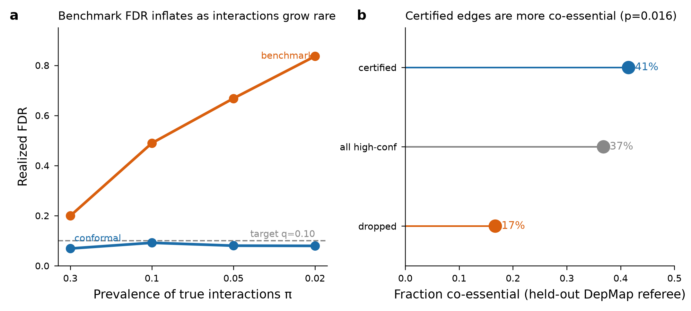
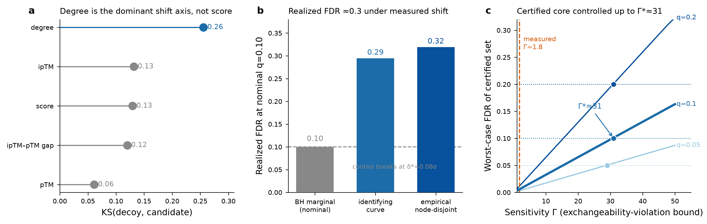
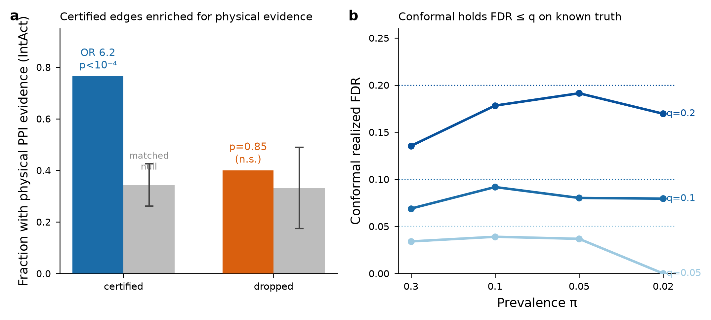
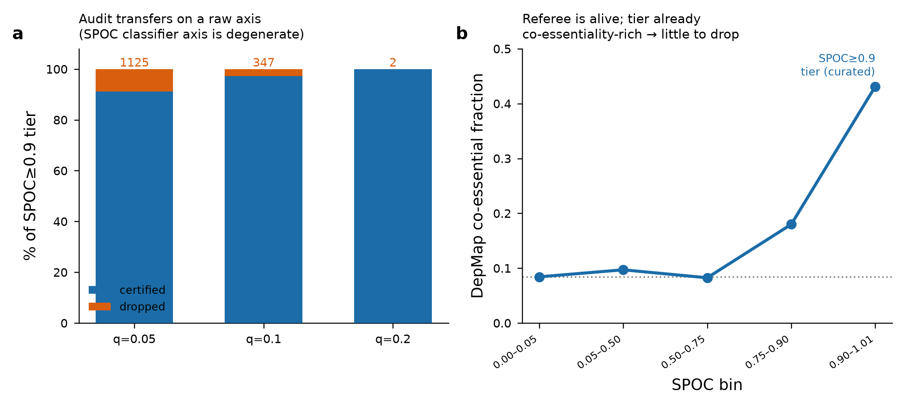

# The Emperor's Interactome

### When can you audit an AI protein interactome? A distribution-free reliability audit of a published AlphaFold-Multimer map, refereed by held-out biology.

---

## Abstract

AI-predicted protein interactomes now label thousands of pairs "high-confidence," but those error rates are estimated on class-balanced benchmarks and inflate sharply in the real regime of a genome-scale screen, where true interactions are rare. The **CM4AI** multimodal cell map (Schaffer et al., *Nature* 2025, Ideker lab; NIH Bridge2AI *Cell Maps for AI* project, contact PI Trey Ideker / co-PI Nevan Krogan, Gladstone Institutes) is among the few AI interactomes that can be audited externally, because it ships a raw confidence axis (AlphaFold-Multimer ipTM) with a native random-pair null — the exchangeable calibration set that distribution-free error control requires.

Applying **conformal false-discovery-rate control** to the map's published high-confidence tier, refereed by **DepMap co-essentiality** under a strict purity firewall, **35 of 161 (22%) high-confidence edges fail honest FDR control at q=0.10**, and certified edges are **41% co-essential versus 17% for dropped edges** (permutation p=0.016). We then interrogate the guarantee itself — measuring the exchangeability violation, showing where the marginal guarantee breaks, and reporting the strongly-certified core as robust to violations far larger than the one present — and validate the certified set against orthogonal wet-lab physical interactions and held-out complex-member recovery. The method transfers to a second, genome-scale AI map.

**Full paper:** [`reports/MANUSCRIPT.md`](reports/MANUSCRIPT.md) · **Short summary:** [`reports/summary.md`](reports/summary.md)

---

## The problem: a "high-confidence" cutoff hides its real error rate

A confidence threshold with a given precision on a class-balanced benchmark (known complexes vs. random pairs at ~1:1) has a very different *realized* false-discovery rate in the true operating regime, where genuine interactions are a small minority of all scored pairs. This **prevalence shift** inflates FDR precisely where confident-looking errors are most costly. On known-truth data, a fixed benchmark-tuned cutoff's realized FDR climbs toward 0.9 as interactions grow rare, while distribution-free conformal control stays bounded at the target q.



**Figure 1. The prevalence wedge and the audit.** (A) On a semi-synthetic benchmark with known truth, a fixed benchmark cutoff's realized FDR inflates to 0.84 as prevalence falls, while conformal + BH holds at the target q=0.10. (B) On the real map, certified edges are 41% co-essential versus 17% for dropped edges (held-out DepMap referee; permutation p=0.016).

---

## The audit: 22% of the high-confidence tier fails honest error control

We score each candidate edge by its nonconformity to the map's native random-pair decoys, compute conformal p-values, and apply Benjamini–Hochberg at q. At q=0.10, **132 of 1,666 candidate edges certify**; within the map's own published high-confidence tier of 161 edges, **35 (22%) fail certification and are dropped**. The held-out co-essentiality referee — data the structural model never saw — confirms the audit's direction: the dropped tail is co-essentiality-poor, and the audit's value is in *removing* it, not re-ranking the whole set.

---

## Interrogating the guarantee: honest about where it breaks

Conformal FDR control is only valid if the calibration decoys are **exchangeable** with the candidate edges. They are not, and we quantify the gap rather than paper over it. We measure a real calibration-to-candidate shift of **0.60σ**, driven predominantly by an unmodeled hub/degree-selection axis (KS 0.26) rather than the confidence score (KS 0.13) — **62% of the divergence is invisible to one-dimensional score reweighting**. The marginal guarantee provably breaks at a shift of only δ*≈0.08σ, so realized FDR is ≈0.30 at nominal q=0.10 (two independent routes). Neither a hard-negative-enriched null nor degree-conditioned calibration restores unconditional control.

What we *can* guarantee is **conditional**: via a Rosenbaum-style sensitivity bound, the strongly-certified core stays FDR-controlled up to a large exchangeability violation Γ\*≈31 — far past the measured Γ≈1.8.



**Figure 2. Interrogating the guarantee (the paper's spine).** (A) Per-covariate shift: union-graph degree (KS 0.26) is the dominant calibration-to-candidate axis, not the confidence score (KS 0.13). (B) Three routes agree the realized FDR under the measured shift is ≈0.30 at nominal q=0.10, with control breaking at δ*≈0.08σ. (C) Rosenbaum-Γ worst-case FDR: the certified core stays ≤ q up to Γ\*≈31, far past the measured Γ≈1.8.

---

## Independent validation

The certified set is stress-tested against evidence outside both the structural score and the functional referee. Against **IntAct** wet-lab physical interactions, certified edges carry physical evidence at **77% versus a degree-matched null of 34%** (matched-null odds ratio 6.2, permutation p<10⁻⁴), while dropped edges are not significantly depleted — an honest boundary: the audit flags statistical-control failures, not proven-false edges. A **leave-one-complex-member-out** test recovers true held-out members at **49.5% versus 23.2%** for eligible impostors (OR 3.3, p<10⁻⁴). A known chromatin-complex member (KANSL3, NSL family) is recovered as a labeled positive control.



**Figure 3. Independent validation.** (A) Certified edges are enriched for independent IntAct physical evidence (77% vs a degree-matched null of 34%, matched-null OR 6.2, p<10⁻⁴); dropped edges are not significantly depleted (p=0.85). (B) Conformal control holds FDR ≤ q across prevalences on known-truth data.

---

## Generality and the auditability standard

The audit transfers to a second, independent real map — the genome-scale human **Predictomes** (Schmid & Walter, *Mol Cell* 2025; 20,196 proteins, 1.6M pairs), at no compute cost — and sharpens the standard in doing so. The audit axis must be a **raw** structural readout: Predictomes' trained SPOC classifier separates candidates from the null too perfectly to audit (every p-value pins to the floor), so we audit its raw interface-contact axis instead. A classifier-curated map also has less for the audit to remove, because its tier is already pre-filtered — the audit's yield scales with how *uncurated* the map's confidence tier is.



**Figure 4. A second real map (Predictomes).** (A) The audit transfers on a raw interface-contact axis (SPOC≥0.9 tier, 12,767 edges; certified/dropped across q). (B) The DepMap referee is alive on this map (co-essential fraction climbs 0.08→0.43 across SPOC bins) but the tier is already uniformly co-essentiality-rich — classifier-curated, so little for the audit to drop, unlike CM4AI's uncurated ipTM tier.

**The contribution, in one sentence:** distribution-free auditing of an AI interactome is only valid to the extent the map ships a calibration null exchangeable with its candidate edges — we quantify how much violation the guarantee tolerates on a real map (Γ\*), and argue that shipping a **raw confidence axis plus a native random-pair null** should be a release standard, tested by transferring the audit to a second map.

---

## Reproduce

```bash
make reproduce    # raw → idmap → labels → conformal audit → validate → nominate → figures
make audit-self   # the full hardened analysis suite (dependence, shift, sensitivity, second map, recovery)
make test         # unit + adversarial firewall + held-out-recovery tests
```

Reproducible from a bare clone: interim tables regenerate from raw data, and the second-map score table auto-fetches from its public source. Every numeric claim traces to a result JSON in `data/processed/`.

## Data and configuration

- **Primary map**: CM4AI, Schaffer et al., *Nature* 2025 (doi:10.1038/s41586-025-08878-3; Bridge2AI *Cell Maps for AI* project, contact PI Ideker / co-PI Krogan) — AlphaFold-Multimer ipTM confidence axis, 1,788 native random-pair decoys as calibration negatives.
- **Positive labels**: CORUM human complexes, complex-disjoint calibration/test split.
- **Held-out referee**: DepMap co-essentiality (Wainberg et al. 2021) — strict purity firewall.
- **Second map**: Predictomes (Schmid & Walter, *Mol Cell* 2025).
- **Target FDR**: q = 0.10 (reported across q ∈ {0.05, 0.10, 0.20}).

## Repository

| Path | Contents |
|---|---|
| `reports/MANUSCRIPT.md` | the full research paper |
| `reports/summary.md` | short summary |
| `src/emperor/` | pipeline (`conformal.py`, `validate.py`, `nominate.py`) + hardening modules |
| `data/processed/` | every result JSON; each numeric claim traces to one |
| `results/figures/` | generated figures |
| `tests/` | firewall, dependence, and held-out-recovery tests (21 tests) |

Licensed MIT.
